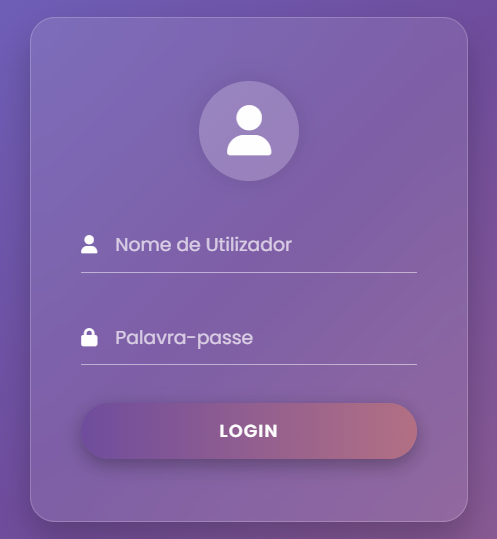
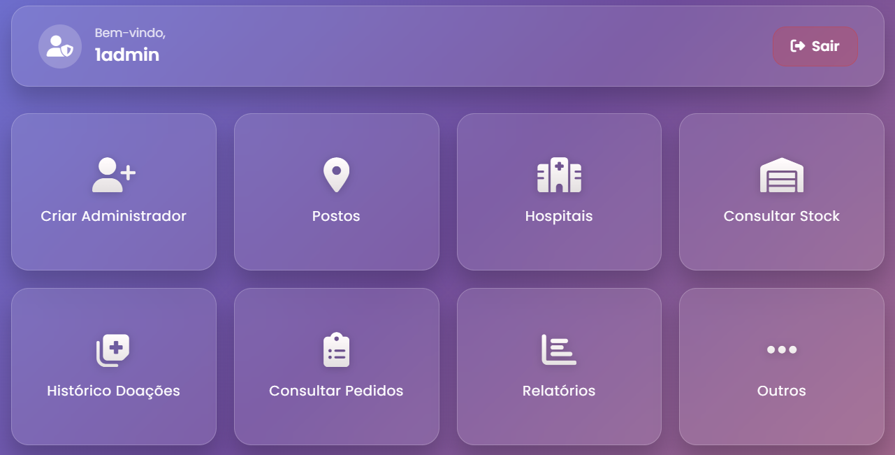
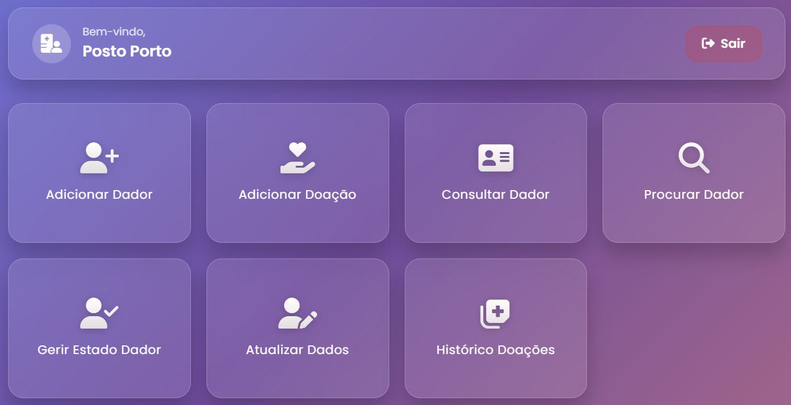

# Sistema Web para Gestão de um Banco de Sangue

## Descrição
Aplicação web desenvolvida no âmbito da UC **Aplicações Distribuídas**, com o objetivo de criar um **sistema de gestão de um banco de sangue com interface gráfica**.

A aplicação permite gerir **dadores, doações, componentes sanguíneos, hospitais e pedidos de sangue**, através de uma interface web que facilita a interação entre os diferentes utilizadores do sistema.

O sistema foi desenvolvido utilizando o **framework Django**, seguindo uma arquitetura cliente-servidor baseada em aplicações web.

Este projeto corresponde à **segunda parte do trabalho**, sendo uma evolução da primeira versão do sistema desenvolvida em **Java com RMI**.  
A versão distribuída em Java pode ser consultada aqui:  
👉 *[link para o repositório Java]*

---

## Tecnologias usadas
- Python
- Django
- HTML
- CSS
- SQLite
- Arquitetura Web Cliente-Servidor

---

## Features
- Registo e gestão de **dadores de sangue**
- Registo de **doações**
- Gestão de **stock de componentes sanguíneos**
- Criação e gestão de **pedidos hospitalares**
- Gestão de **hospitais e postos de recolha**
- Interface gráfica para interação com o sistema
- Visualização e consulta de dados através da aplicação web

---

## Screenshots

### Login

### Menu do Administrador

### Menu de Posto

### Menu de Hospital

---

## Arquitetura
O sistema segue uma arquitetura **web baseada no framework Django**, onde:

- O **backend** implementa a lógica de negócio e comunicação com a base de dados
- O **frontend** apresenta a interface gráfica ao utilizador através de páginas web
- A **base de dados SQLite** armazena informação sobre dadores, doações, hospitais e stock de sangue
